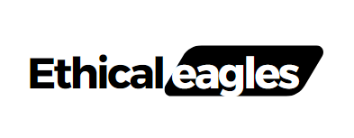
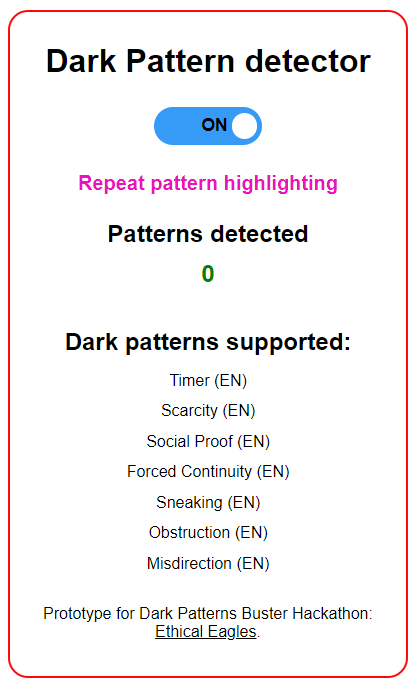
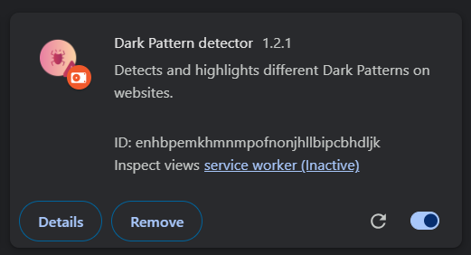
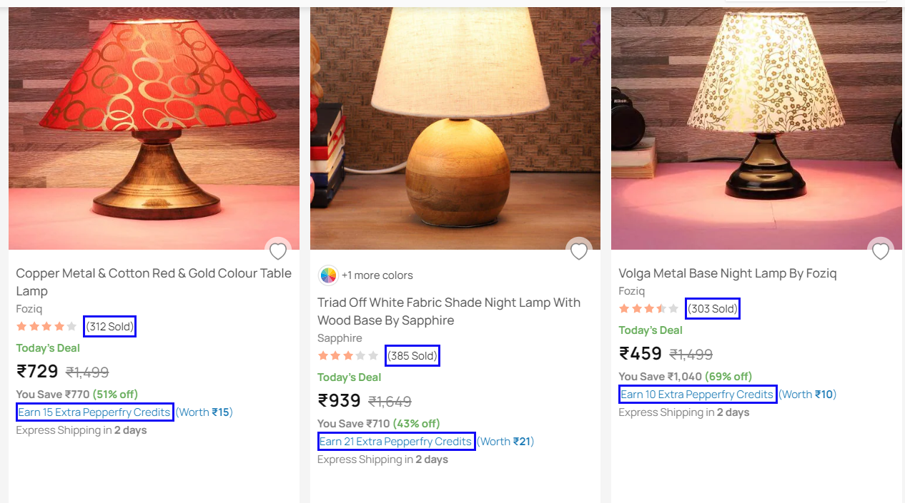

# Ethical Eagles Dark Pattern Detector

<p align="center">
  
</p>

## Overview

Welcome to the Ethical Eagles Dark Pattern Detector repository! Our team from IIT Kharagpur has developed a powerful browser extension that detects and exposes dark patterns in e-commerce websites. Dark patterns are deceptive design techniques used to manipulate users, and our extension is designed to ensure a more ethical online shopping experience.

## Dataset Used

We have used the dataset from the paper (Dark patterns in e-commerce: a dataset and its baseline evaluations)[https://arxiv.org/abs/2211.06543] to train our transformer model.
The dataset has 2,356 sentences, and their corresponding outputs indicating the existence of dark patterns. 

## Features

- **Countdown Tracker:** Detects and analyzes countdown timers, preventing false urgency.
- **Scarcity Detector:** Identifies scarcity claims such as "Only 8 left" or "99% claimed" to protect consumers from false scarcity.
- **Pricing Transparency:** Exposes hidden costs and recurring payment information, like "₹10.99/month after" and "after that ₹23.99 per month."
- **Fake Review Identifier:** Scrutinizes social media reviews to identify and flag potential fake or manipulated reviews.
- **Misinformation:** Detects and alerts users to instances of misinformation, ensuring they are informed accurately during their online interactions.
- **Sneaking Obstruction:** Identify and mitigate sneaky tactics designed to hinder users' ability to make informed choices, empowering them to navigate websites freely and without obstruction.
- **Forced Action:** Detects and highlights instances where users are coerced into taking actions they may not intend, allowing users to make decisions without undue influence or pressure

## Installation
<p align="center">
  
</p>
<p align="center">
  
</p>
<p align="center">
  
</p>

To install the extension, follow these steps:

1. Clone this repository:

   ```bash
   git clone https://github.com/deep-sekhar/dark-detector.git
   ```

2. Open your browser and navigate to chrome://extensions/  (for Chrome).

3. Enable "Developer mode."

4. Click on "Load unpacked" and select the cloned repository folder.

5. The Ethical Eagles Dark Pattern Detector extension is now installed!

6. Before running the model server, you need to have the following libraries installed:
  ```bash
  pip install flask
  pip install transformers
  pip install torch
  pip install flask_cors
  pip install pytesseract
  ```
Also, install tesseract-ocr from the following link:
  ```bash
  https://digi.bib.uni-mannheim.de/tesseract/tesseract-ocr-w64-setup-5.3.3.20231005.exe
  ```

7. Create a .env file in the root directory of the project and add the following lines:
  ```bash
  TESSERACT_PATH = r'C:\Program Files\Tesseract-OCR\tesseract.exe'
  ```
Check if the path is same for your system. If not, change the path accordingly.

8. For the model server, you need to log in to your Hugging face account from cli and run the flask app using "python app_local.py" command.

9. Now you can use the extension to detect dark patterns on e-commerce websites!

## Usage

1. Visit an e-commerce website.

2. Click on the Ethical Eagles icon in your browser toolbar.

3. The extension will analyze the page and notify you of any detected dark patterns.

4. Stay informed and make ethical choices while shopping online!

## Meet the Team

- **[Ayushi Saha](https://github.com/Code-2k2)**
- **[Daksh Kochhar](https://github.com/17AtGithub)**
- **[Deep Sekhar Ghosh](https://github.com/deep-sekhar)**
- **[Sanskar Gupta](https://github.com/sanskar12k)**
- **[Souvik Mondal](https://github.com/souvikm2002)**

## License

This project is licensed under the MIT License - see the [MIT](https://choosealicense.com/licenses/mit/) file for details.

## Acknowledgments

We would like to express our gratitude to the open-source community for their valuable contributions and support.

Happy ethical shopping! 🛍️

[](LICENSE)